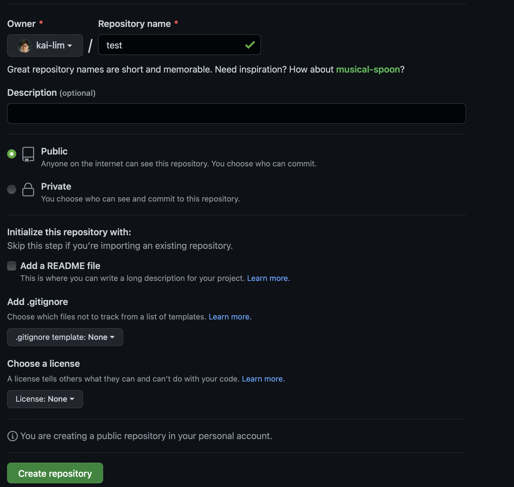
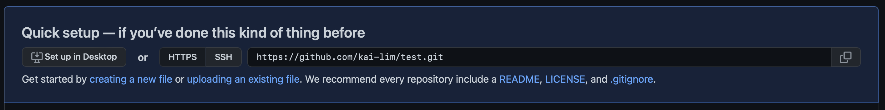

# Notes for git/github

This is a note/cheatsheet written as a reference for how to create a git repo and link it with a remote repo, and how to create a branch, and merge it with the main branch. 

# Step 1: Create a directory and initiate git version control in it
```{bash, eval=FALSE}
mkdir test #create a new directory
cd test #change directory, enter the "test" folder
git init #initiate a new git repo in the directory
```

# Step 2: Go to Github and create a new repo

Avoid creating a README file at this stage to avoid potential issues when linking the local repo to this remote repo.



# Step 3: link the local repo with the remote repo

In this example, the link is https://github.com/kai-lim/test.git 



If there are already some files in the repo, add them and commit 
```{bash add, eval=FALSE}
git add .
git commit -m "first commit"
```

Now create the main branch, add the remote repo, and link the main branch to the remote repo
```{bash main, eval=FALSE}
git branch -M main
git remote add origin https://github.com/kai-lim/test.git
git push -u origin main
```

Use `git status` to check if everything is okay, output should be something like below:
```{bash git-status, eval=FALSE}
(base) MacBook-Pro:test kai$ git status
On branch main
Your branch is up to date with 'origin/main'.

nothing to commit, working tree clean
```

# Step 4: Creating branch
To create a branch, use git checkout.
However, before doing anything new on the local repo, it's always a good practice to do `git pull`
```{bash branch, eval=FALSE}
git pull
```

Output: 
```
Already up to date.
```

Now let's use `git checkout` to create a new branch called `twigs`. We use -b to checkout to a new branch named `twigs`, which is branching from the `main` branch.
```{bash branch2, eval=FALSE}
git checkout -b twigs main
```

Output: 
```
Switched to a new branch 'twigs'
```

Use `git branch` to check which branch you are at. Right now I am at `twigs`:

```
  main
* twigs

```

Now, within the branch you can create a new file, say a txt file called "hello" that contains the text "Hello". In practice, this can be you working on RStudio, creating or changing scripts.
```{bash hello, eval=FALSE}
echo "Hello" >> hello.txt

```
Check on your folder if this file has been created. :)

# Step 5: Committing changes in branch
Now we will commit this hello.txt file.

```{bash commit-branch, eval=FALSE}
git add hello.txt
git commit -m "commit branch"
```

# Step 6: Switching branch
Now let magic happen! We are going to switch back to the main branch and see if the "hello.txt" file will still exist on the main branch.

```{bash switch, eval=FALSE}
git checkout main 
ls
```

We are at the main branch now, and when we type `ls` or check on the GUI, the hello.txt file is gone! Fret not, it is safely in the `twigs` branch. Don't believe it? Let's switch to the `twigs` branch.

```{bash swtich-twigs, eval=FALSE}
git checkout twigs
ls
```

Tips: Remember you can always use `git branch` to check which branch you are at!

PS: If you are bored, you can open the terminal and your finder side-by-side, and type `git checkout main` and `git checkout twigs` alternatively to see how the file appears and disappears! Magic!!

# Step 7: Linking branch to remote repo
This is not the end yet, as our local branch is still not "connected" to our remote repo. To do this:

```{bash push-branch, eval=FALSE}
git push -u origin twigs
```

Output:
```
To https://github.com/kai-lim/test.git
 * [new branch]      twigs -> twigs
Branch 'twigs' set up to track remote branch 'twigs' from 'origin'.
```

On your Github repo, you should be able to see this notification: 

 


## Option 1: Merge on Github

Click on "Compare & Pull Request", then "Create pull request". This will create a pull request (often known as PR). If you click on "Merge pull request", the `twig` branch will be merged to the main branch.

## Option 2: Merge locally on command line

This is another possible option but personally I prefer option 1. 

First, go back to the main branch, then use `git merge` to merge the `twigs` branch to the main branch:

```{bash go-back, eval=FALSE}
git checkout main
git merge twigs
```

You should get something like:

```
Updating 31e014e..68ffcbc
Fast-forward
 hello.txt | 1 +
 1 file changed, 1 insertion(+)
 create mode 100644 hello.txt
```

Now if you `git checkout` to main, you should be able to see `hello.txt` in the main branch.

```{bash git-checkout-merge, eval=FALSE}
git checkout main
```

```
Already on 'main'
Your branch is ahead of 'origin/main' by 1 commit.
  (use "git push" to publish your local commits)
```

```{bash ls, eval=FALSE}
ls
```

```
hello.txt
```

# Step 8: Git push merged branch to remote repo

Now you can use `git push` to push the merged branch to your remote repo. 

# Step 9: Delete merged branch

To delete a branch locally, do `git branch -d <branch>.`

To delete a branch remotely, do  `git push <remote> --delete <branch>` or `git push <remote> :<branch>`

```{bash delete-branch, eval=FALSE}
# delete locally:
git branch -d twigs

# delete remotely:
git push origin :twigs #spacing is important here, note that there is a space after "origin" and no space before "twigs"

```

Output when local branch deleted:
```
Deleted branch twigs (was 68ffcbc).
```

Output when remote branch deleted:
```
To https://github.com/kai-lim/test.git
 - [deleted]         twigs
```

# Bonus: Doing this on RStudio

I have found a few links/resources that can help us doing this more seamlessly on Rstudio:

## [How to switch branch on RStudio:](https://aberdeenstudygroup.github.io/studyGroup/lessons/SG-T1-GitHubVersionControl/VersionControl/) 

 - Create a new branch on Github
 - Git pull on RStudio
 - Click on "main" or "master" dropdown menu at the Git panel, the new branch should be visible
 - Clicking on the new branch will help you switch to it!
 
## Links that may be useful: 
 
 1. [Happy Git with R](https://happygitwithr.com/index.html)
 
 2. [Git cheatsheet from Atlassian](https://www.atlassian.com/git/tutorials/atlassian-git-cheatsheet)
 
 3. [Git cheatsheet from freecodecamp](https://www.freecodecamp.org/news/git-cheat-sheet/)
 
 4. [Git cheatsheet from Github Education](https://education.github.com/git-cheat-sheet-education.pdf) <- this is my fav!!
